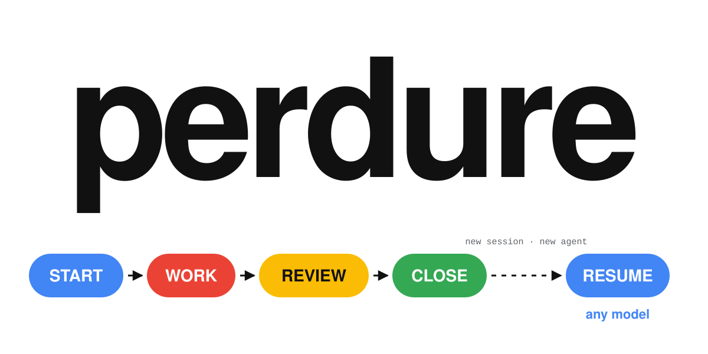
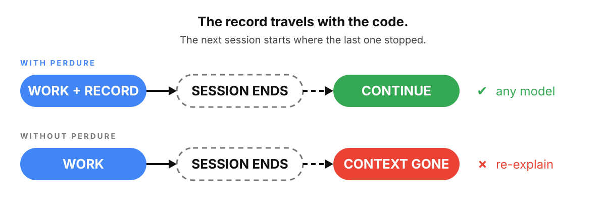
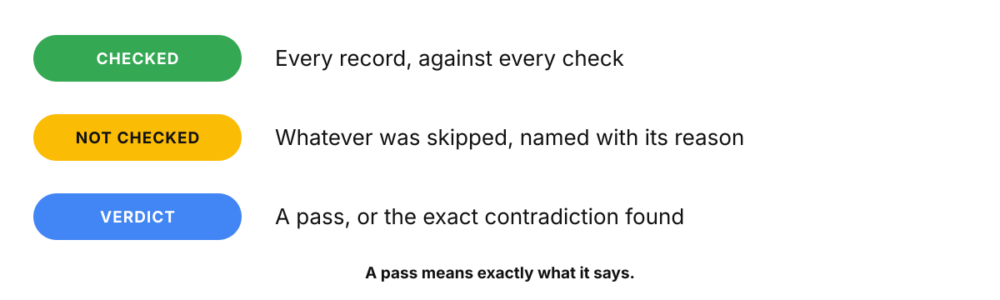

# perdure

**Checked memory skills for AI coding agents.**

**Resume anywhere. Any task, any session, any model, from a checkout.**

A record is what a senior engineer leaves behind: what was decided, what was
ruled out, what comes next. perdure has AI agents write it as they work, keeps
it in git beside the code, and checks it like code, so a checkout is the full
context for the next session, the next agent, or you in three weeks.

<p align="center">
  
</p>

```
  START          WORK           REVIEW         CLOSE                   RESUME
┌───────────┐  ┌───────────┐  ┌───────────┐  ┌───────────┐           ┌───────────┐
│ one record│─▶│  what was │─▶│independent│─▶│lint · gate│─ ─ ─ ─ ─ ▶│ checkout. │
│  per task │  │  decided, │  │  verdict, │  │  HANDOFF  │new session│ any model.│
│           │  │ set aside │  │  appended │  │ on verdict│ new agent │ continues.│
└───────────┘  └───────────┘  └───────────┘  └───────────┘           └───────────┘
  start                         verdict        close                   continue
```

---

## Why perdure?

The session ends. The context compacts, or a different model picks up the task.
The plan is gone, the paths you ruled out are back on the table, and the agent
is about to try the one you rejected last week.

<p align="center">
  
</p>

perdure makes the checkout the memory. Install once, and the model opens a
record when a task begins, writes it as it works, the hook checks it, and the
close needs a verdict. Nothing else changes in how you work.

If you know decision records, you know half of perdure. The other half is the
same idea applied to the whole task, written by the agent and checked by a
script.

It works beside any skill pack: they make the agent build well, perdure makes
it remember. In daily use on the author's production repositories since March
2026.

---

## What you get

- **Nothing to re-explain.** The next session, or the next model, reads the record and continues.
- **Decisions on the record.** Every choice, and every path set aside, written down where the code lives.
- **A check that shows its work.** It tells you which records still hold, and names what it did not check.
- **No service, no account.** Plain markdown files in your repository, and nothing else to keep running.

---

## Quick start

<details open>
<summary><b>Claude Code</b></summary>

```bash
claude plugin marketplace add arbelh/perdure
claude plugin install perdure@perdure
```

Then, in a Claude Code session:

```
/perdure:install
```

The plugin install adds the `/perdure:*` commands and two hooks: the lint runs
on its own when a record closes, and sessions can be archived before `/compact`.
`/perdure:install` is what makes it automatic. It writes the records directive
into `~/.claude/CLAUDE.md`, so the model opens a record when a task begins and
closes it when the work is done, without being asked, and it asks a few
preference questions. Skip it and you drive with `/perdure:start`.
`/perdure:health` checks the setup; `/perdure:uninstall` reverses everything.

</details>

<details>
<summary><b>Any agent, one command</b> (Codex, Cursor, Copilot, Windsurf and 70+ more)</summary>

The open [skills CLI](https://github.com/vercel-labs/skills) installs perdure's
fourteen skills into the agent of your choice:

```bash
npx skills add arbelh/perdure                     # all fourteen skills
npx skills add arbelh/perdure --list              # browse first
npx skills add arbelh/perdure --skill continue    # just the one you need
```

> **Nothing else to clone.** Every skill that runs a check carries `scripts/`
> with it: Python 3, no dependencies. Drop `templates/AGENTS.md` into your
> project and any model follows the convention.

</details>

<details>
<summary><b>Codex CLI, native plugin</b></summary>

```bash
codex plugin marketplace add arbelh/perdure
codex plugin add perdure@perdure
```

Codex CLI 0.122 or later. The same fourteen skills; Codex keeps the whole
checkout in its plugin cache, so the checks are in its `scripts/` directory.

</details>

<details>
<summary><b>No agent: CI, or by hand</b></summary>

```bash
git clone https://github.com/arbelh/perdure ~/perdure
cd your-project
python3 ~/perdure/scripts/rot-lint.py --strict .   # exits 1 on a contradiction
python3 ~/perdure/scripts/handoff.py . --check     # exits 1 when the page is stale
```

</details>

---

## Commands

| What you're doing | Command | Key principle |
|---|---|---|
| Pick up where you left off | `/perdure:continue` | Any session. Any model. |
| See where things stand | `/perdure:handoff` | Orientation in one page |
| Start a task | `/perdure:start` | One record per task |
| Get an independent review | `/perdure:verdict` | A second pair of eyes, on the record |
| Close it out | `/perdure:close` | Closes on a verdict |
| Record a decision | `/perdure:decide` | Outlives the task |
| List your tasks | `/perdure:list` | Everything open, at a glance |

Any other agent: the same skills by name — `continue`, `handoff`,
`start`, `verdict`, `close`, `decide`.

---

## All fourteen skills

The commands above are the daily path. Every skill is a plain `SKILL.md` any
agent can read, with its scripts beside it.

### Record the work

| Skill | What it does | Use when |
|---|---|---|
| [start](skills/start/SKILL.md) | Opens one record for the task, with the sections the convention names | You begin a task that will outlast one session |
| [continue](skills/continue/SKILL.md) | Resumes from the record, in any session, with any model | A new session opens, or a different model picks the task up |
| [close](skills/close/SKILL.md) | Lints, checks the verdict, sets the status, writes the HANDOFF page | The work is done and reviewed |
| [list](skills/list/SKILL.md) | Every record and its status, at a glance | Before you start anything, to see what is open |

### Judge it

| Skill | What it does | Use when |
|---|---|---|
| [verdict](skills/verdict/SKILL.md) | An independent review, appended to the record; closing requires one | Before you call a task done |
| [decide](skills/decide/SKILL.md) | A decision record that outlives the task, alternatives included | A choice will outlive the task: architecture, data, cost, security |
| [decisions](skills/decisions/SKILL.md) | The decisions in force, superseded, or rejected | Before you change something an earlier decision covers |

### Hand it over

| Skill | What it does | Use when |
|---|---|---|
| [handoff](skills/handoff/SKILL.md) | The one-page orientation, generated from the records; `--check` confirms it is current | Handing the project to someone else, or to yourself next month |
| [archive](skills/archive/SKILL.md) | A session transcript as portable markdown, local by default | A session worth keeping as text, before compaction or at day's end |

### Measure it

| Skill | What it does | Use when |
|---|---|---|
| [raw](skills/raw/SKILL.md) | An index of the sessions that ran: the denominator for coverage | Measuring how much of the work left a trail |
| [coverage](skills/coverage/SKILL.md) | How many sessions left a record, and how strong each link is | Asking which sessions never left a record |

### Set up

| Skill | What it does | Use when |
|---|---|---|
| [install](skills/install/SKILL.md) | Adds the records directive to your Claude Code CLAUDE.md; optional | Once, after installing the plugin in Claude Code |
| [health](skills/health/SKILL.md) | Checks the setup and the installed version | Something seems off, or after an update |
| [uninstall](skills/uninstall/SKILL.md) | Reverses install, nothing else | You want the directive and preferences gone |

---

## What the check tells you

<p align="center">
  
</p>

It runs at every close, on its own. Nothing is counted as passed that was never
looked at.

---

## How it works

Every record follows one anatomy:

```
┌────────────────────────────────────────────────────────────────┐
│ perdure/workflows/2026-09-15-greet-fn.md                       │
│                                                                │
│ ┌─ Frontmatter ────────────────────────────────────────────┐   │
│ │ workflow: greet-fn                                       │   │
│ │ status:   in-progress | parked | completed | abandoned   │   │
│ │ started:  2026-09-15T09:12:00Z                           │   │
│ │ updated:  2026-09-15T10:40:00Z                           │   │
│ └──────────────────────────────────────────────────────────┘   │
│                                                                │
│ # Goal           → one to three sentences                      │
│ # Plan           → checkboxes                                  │
│ # Findings       → what exploration and work returned          │
│ # Decisions      → choices made; lasting ones become ADRs      │
│ # Files modified → as edits land                               │
│ # Open questions → what is unresolved                          │
│ # Next step      → always current: the resume point            │
│ # Review         → the verdict block; the gate reads it        │
│ # Outcome        → filled at close                             │
└────────────────────────────────────────────────────────────────┘
```

**Key design choices:**

- **One file per task.** Records shard per task, so parallel work never fights over a shared index.
- **Status is a vocabulary.** Four words the checks can read. Anything else trips the close gate.
- **The gate checks the record, not the reviewer.** Any independent verdict in the schema satisfies it: another plugin's agent, a generic subagent, a person.
- **Derived pages are generated, never edited.** The HANDOFF page is rebuilt from the records; a hand edit earns a warning and a regeneration.
- **Checks report their coverage.** Every run ends with which checks ran on which records, and why the rest did not.

Three layers, each worth a different degree of trust:

| Layer | What it holds | Who produces it |
|---|---|---|
| **Asserted** | the records: what was decided, set aside, still open | whoever did the work |
| **Observed** | an index of the sessions that ran | the `raw` skill, from Claude Code's session files |
| **Derived and checked** | the HANDOFF page, the lint, coverage | scripts, from the two layers above |

The checked layer only ever reports what it read, and says so. The full account
is in [docs/THREE-LAYERS.md](docs/THREE-LAYERS.md).

---

## How it compares

| | session resume (per tool) | a notes file | perdure |
|---|:-:|:-:|:-:|
| lives in your repository, versioned with the code | — | ✓ | ✓ |
| readable by any tool, any model | — | ✓ | ✓ |
| checked for contradictions | — | — | ✓ |
| reports what it did not check | — | — | ✓ |
| a review verdict before a task closes | — | — | ✓ |

---

## What ships

| Piece | What it is |
|---|---|
| **The convention** | [docs/RECORDS-CONVENTION.md](docs/RECORDS-CONVENTION.md): one record per task under `perdure/`, decision records, a review-verdict schema. Plain markdown; any agent can follow it. |
| **The lint** | `scripts/rot-lint.py`: five deterministic checks and a coverage table for every run. The skills run it at every close; `--strict` for CI. |
| **The close gate** | a hook that lints a record as it closes and keeps the HANDOFF page current. |
| **The review gate** | `/perdure:verdict` appends an independent verdict; closing requires one. |
| **The HANDOFF page** | `perdure/HANDOFF.md`, built from the records: what is in force, what is open, each claim with its source. Created at the first close, kept current by the close gate; `/perdure:handoff --check` confirms it. |
| **Coverage** | `/perdure:raw` indexes the sessions that ran; `/perdure:coverage` shows how many produced a record. |
| **Archives** | `/perdure:archive` exports transcripts to markdown under `perdure/archives/`, local by default. |
| **Decisions** | `/perdure:decide`, `/perdure:decisions`. |

<details>
<summary><b>Project structure</b></summary>

```
.claude-plugin/    plugin.json · marketplace.json   — Claude Code
.codex-plugin/     plugin.json                      — Codex CLI
.agents/plugins/   marketplace.json                 — Codex CLI
skills/            the fourteen skills — what any agent reads
scripts/           rot-lint · handoff · close-workflow · new-workflow · coverage · raw-index · export-session
hooks/             close gate · pre-compact archive
docs/              RECORDS-CONVENTION.md · THREE-LAYERS.md
templates/         AGENTS.md — the stanza your project receives
```

</details>

---

## Releases

Every release passes a deterministic eval gate and isolated end-to-end dry
runs against the exported checkout, then ships through a whitelist export.
The published tree is the plugin, exactly as installed.

A companion plugin, **perdure-team** (five specialist agents), will be
published at a later time.

---

## Contributing

Small changes that keep the plugin small land fastest. [CONTRIBUTING.md](CONTRIBUTING.md)
says what to check before a pull request and what shape a skill, a script, or a
tool adapter takes.

---

## Author

<table><tr>
<td></td>
<td><b>Arbel Hakopian</b> · <a href="https://github.com/arbelh">@arbelh</a></td>
</tr></table>

---

## License

MIT. Use it in your projects, teams, and tools.
